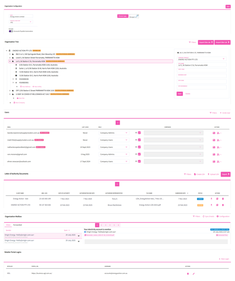

# Admin

Utilibox help seamlessly manage your company's details, user roles, and communications all in one centralised hub. Tailor the platform to your corporate identity, efficiently oversee subsidiaries, streamline authorisation processes, and simplify bill handling.

_Organisational Configuration_ Ensures the platform aligns with the company's fiscal calendar and corporate identity.

_Organisation Tree_ Allows for structured representation and management of your extended entities. Facilitates managing various subsidiaries and associated sites within the broader organisational structure.

_Letter of Authorities (LOA)_ Streamlines authorisation processes, ensuring seamless business operations. Utilibox has a dedicated UI and wizard for adding or crafting LOA’s associated with different company names or ABN’s.

_Mailbox_ Facilitates the receipt and processing of Supplier invoice emails: \* Invoices received are auto loaded and processed for payment reporting. \* Non invoice notifications can be processed by rule, forwarded to specific recipients or groups

_Retailer Portal Logins_ You can securely record your retailer portal login details. This enables automatic scraping of portal logins to download bills. This minimises bill handling, reducing time spent and potential errors.

<figure><figcaption></figcaption></figure>

