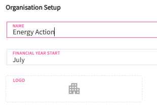
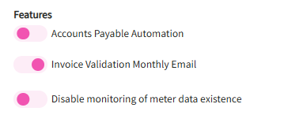

# Organisation Configuration

Organization-wide settings can be hard to manage without a clear central view. This page gives admin users a single place to view and update high-level configurations, keeping your organization aligned and in control.\
\
&#xNAN;_&#x4F;rganisational Configuration_ ensures the platform aligns with the company's fiscal calendar and corporate identity. 

* **Name** – this field can be used to edit the name of the organisation after its created from the main EAX admin page.
* **Financial Year Start** – this field allows users to set the month the financial year begins for the organisation which has a default month of July when an organisation is created.
* **Choose Logo** – this button allows users to upload the organisation’s logo.

<figure><figcaption></figcaption></figure>

* **Features** – this switch allows users to enable or disable automation for accounts payable and is set to disable as a default setting when an organisation is created

<figure><figcaption></figcaption></figure>

* **Enable SSO** – This switch allows administrators to configure how users securely sign in to Utilibox using Single Sign‑On (SSO).

<figure><figcaption></figcaption></figure>

[configuration-of-single-sign-on-sso.md](configuration-of-single-sign-on-sso.md "mention")
