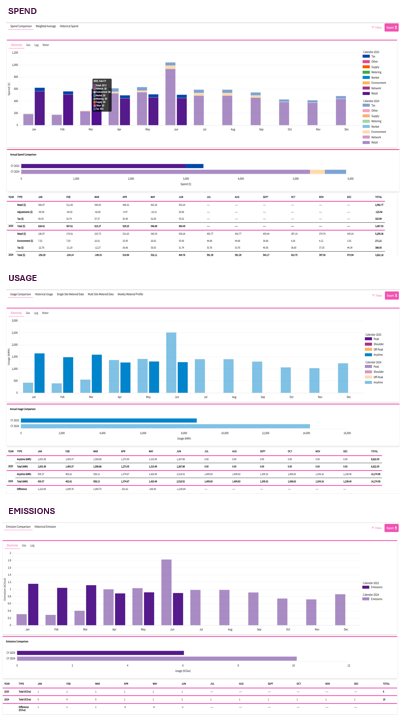

# Analysis

Utilibox' reports feature helps optimize your financial and energy strategies with comprehensive insights.

* _Spend Reports_ - understand your spending trends and make informed financial decisions.
* _Usage Reports_ - aids in identifying usage patterns and implementing efficiency measures.
* _Emissions Reports_ - facilitates the tracking and strategising for businesses carbon reduction efforts.
* _Network Tariff Optimisation_ - processes available data to help businesses lower energy costs by making sure they’re on the most efficient tariff for how they actually use electricity.

<table data-view="cards"><thead><tr><th data-hidden data-card-cover data-type="image">Cover image</th><th data-hidden data-card-target data-type="content-ref"></th></tr></thead><tbody><tr><td><a href="../../.gitbook/assets/Spend.png">Spend.png</a></td><td><a href="spend.md">spend.md</a></td></tr><tr><td><a href="../../.gitbook/assets/Usage.png">Usage.png</a></td><td><a href="usage.md">usage.md</a></td></tr><tr><td><a href="../../.gitbook/assets/Emissions.png">Emissions.png</a></td><td><a href="emissions.md">emissions.md</a></td></tr><tr><td><a href="../../.gitbook/assets/NTO.png">NTO.png</a></td><td><a href="network-tariff-optimisation/">network-tariff-optimisation</a></td></tr><tr><td><a href="../../.gitbook/assets/Reports History.png">Reports History.png</a></td><td><a href="report-history.md">report-history.md</a></td></tr></tbody></table>

<figure><figcaption></figcaption></figure>

