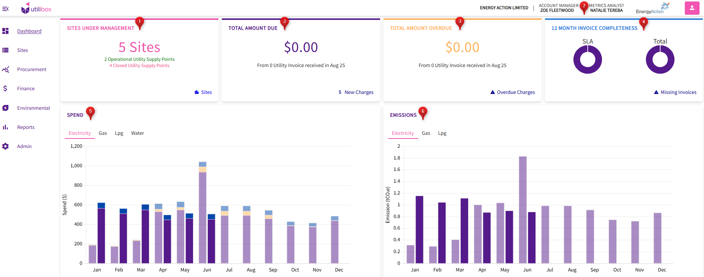

# Dashboard

Utilibox is an easy-to-use app that helps you handle all your energy needs.

You need to see an overview of your organization? At a quick glance you'll be able to view:

1. Sites Under Management - shows the number of sites with details of number of supply points and their current status for your organization.
2. Total Amount Due - shows your organization's total bills/amount to be paid from the most recent invoices received for the month.
3. Total Amount Overdue - shows your organization's total missed bills/amount to be paid from previous months invoices.
4. Invoice Completeness - shows your organization's stats of invoices received in the last 12 months.
5. Spend Chart - shows your organization's monthly spend per commodity and broken down per charge based on available invoices with comparison from previous to current calendar year.
6. Emissions Chart - shows your organization's monthly emissions per commodity based on avalable usage data with comparison from previous to current calendar year.
7. For help or advice, your account manager and metrics analyst is a click away to contact.

Utilibox makes managing your energy simpler and user-friendly.

<figure><figcaption></figcaption></figure>

Upon login, user will be directed to the Organisation’s home page or dashboard and the available features that user can navigate to.

1. Home button - this feature allows users to navigate back to the Dashboard from other windows or tabs in Utilibox
2. Organisation Name and Logo
3. Account Manager – shows the name of the Energy Action representative managing the organisation.
4. Metrics Analyst – shows the name of the Energy Action analyst managing the deliverables for the organisation.
5. User profile button - this feature serves the following purposes:
   * Allow users to logout
   * Allow EAX users to go back to the EAX admin page when in an organisation window
   * View the username logged in
   * View the current version of Utilibox
6. Hamburger button - this feature allows users to hide/show the toolbar
7. Toolbar - this feature allows users to navigate the available menus
