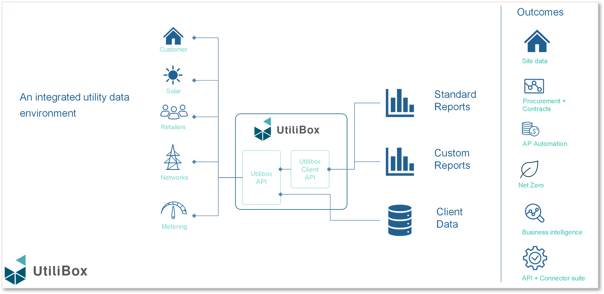
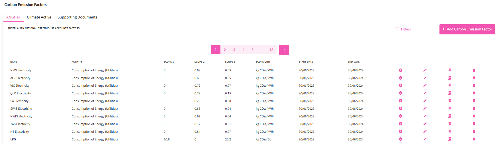
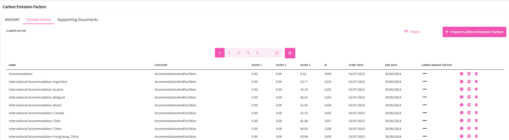
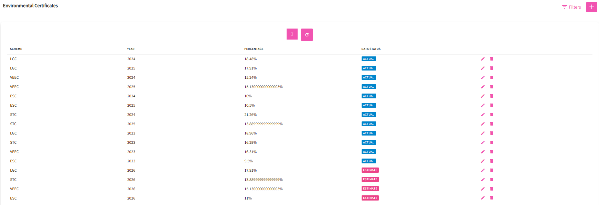
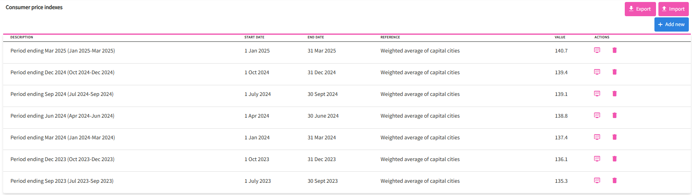
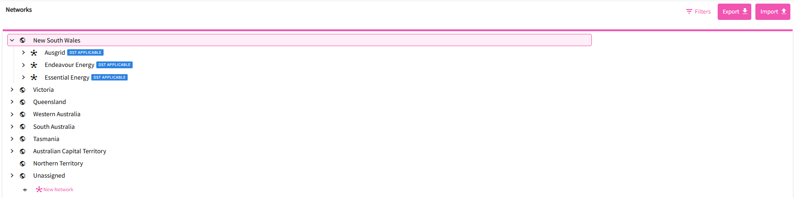
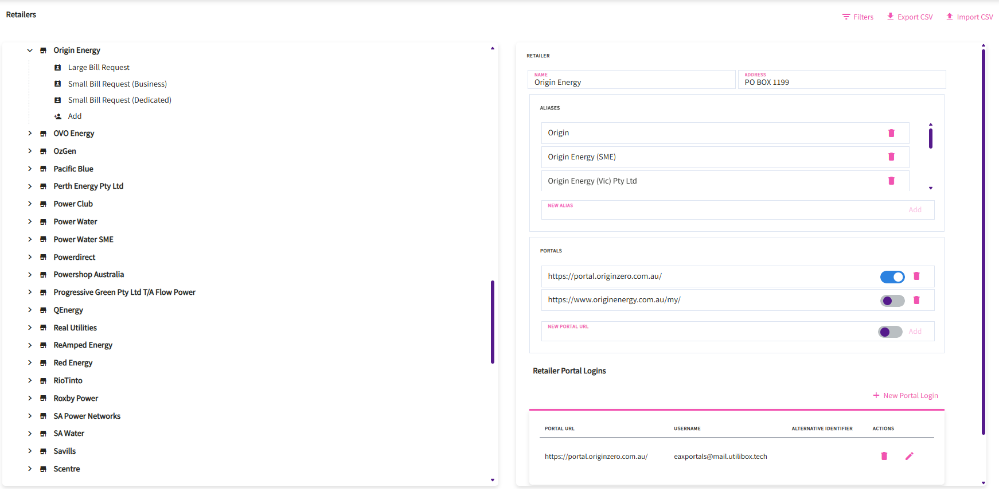
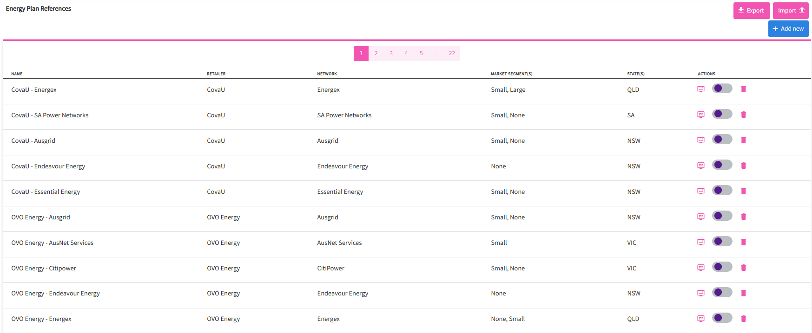
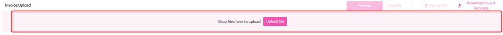
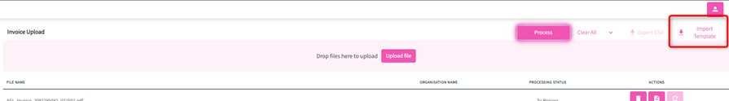

# Data Integration

Utilibox offers customers a user-friendly way to navigate the often-complex energy markets. Breaking down complicated energy data sets, making things like invoices, meter data, network tariffs, and supply point details easier to understand and manage.

Energy users can now handle their energy data more effectively and without hassle.

<figure><figcaption></figcaption></figure>

### Reference Data

This feature is where Utilibox stores different data sources that is referenced across other Utilibox features like network tariff review, environmental reports and retailer information.

_Note: Most of these data are only available to view/edit for EAX admin users._

#### Emission Factors

A carbon emission factor (EF) is a coefficient that estimates how much greenhouse gas (GHG) is released into the atmosphere by a specific activity. EFs are used to calculate carbon footprints and evaluate the environmental impact of products and processes.

This feature allows Energy Action to list and manage emission factor sources used in standard and custom reports.

_Australian National Greenhouse Accounts Factors_&#x20;

<figure><figcaption></figcaption></figure>

_Climate Active_&#x20;

<figure><figcaption></figcaption></figure>

#### Environmental Certificate

An environmental certificate is a tradable unit of proof for achieving a specific environmental outcome, such as generating renewable energy or reducing energy consumption. These certificates are issued under government schemes and incentivize activities that reduce greenhouse gas emissions and promote clean energy.

This feature allows Energy Action to list and manage issued certificates yearly and used in standard and custom reports.

<figure><figcaption></figcaption></figure>

#### Consumer Price Index

The Consumer Price Index (CPI) tracks the average price changes of energy products and services bought by households. The Australian Bureau of Statistics (ABS) collects prices from energy providers and other sources to measure these shifts, reflecting increases or decreases in household energy costs over time and helping to gauge inflation in the energy sector.

<figure><figcaption></figcaption></figure>

#### Networks

A network tariff is a charge by electricity network businesses (DNSPs) for the use of their poles and wires infrastructure to deliver electricity, covering the costs of building, maintaining, and operating the network. These charges are separate from the cost of the electricity itself and are regulated by the Australian Energy Regulator (AER), requiring DNSPs to submit tariff structure statements for approval. The structure of these tariffs can be complex and varies by state and provider.

This feature allows Energy Action to list and manage available network tariffs used in standard and custom reports.

<figure><figcaption></figcaption></figure>

#### Retailers

An energy retailer is the company that buys wholesale electricity or gas and sells it directly to homes and businesses, acting as the final link in the supply chain to the end-user customer.

This feature allows Energy Action to list and manage all market participants who provide service to their clients.

<figure><figcaption></figcaption></figure>

#### Energy Plan Reference

An "energy plan reference" typically refers to the Default Market Offer (DMO), which is a regulated price cap on electricity plans set by the Australian Energy Regulator (AER) for Victorian households and small businesses. This DMO acts as a reference price, making it easier for consumers to compare different retailers' standing offer plans by providing an annual maximum total bill amount, ensuring that retail plans do not exceed this benchmark.

This feature allows Energy Action to list and manage available energy plan references used in standard and custom reports.

<figure><figcaption></figcaption></figure>

### Invoice/Meter Data Upload

This feature allows you to upload invoices/meter data manually or import a template to parse and create the invoice record to its respective site.&#x20;

> _Note: Meter Data upload is only available for EAX admin users_

#### Ways to parse invoices/meter data

_**Dragging and dropping the files on the pink area.**_

<figure><figcaption></figcaption></figure>

_**Clicking on the Upload file button**_

1. File Explorer will open > navigate to where invoices/meter data to upload are stored/saved&#x20;
2. Select the file/s to be uploaded --- can be multiple, and click Open
3. This will upload the files as shown below and ready to be processed, Click on process to proceed with parsing the invoices/meter data.&#x20;
4. Upon processing, the status of each invoice/meter data will be shown on the “Processing Status” column.&#x20;
5. And will show the final status once done.
6. User can remove/view/reparse a file > a delete, view and reparse button are available at the end of each line.&#x20;

<figure><figcaption></figcaption></figure>

_**Importing a template (only applicable for invoices)**_

In instances where an excel file is provided with invoice details, this option can be used to process and link the individual invoices to its corresponding organisation.

1. Click on the Import Template button at the top right corner of the screen.&#x20;

<figure><figcaption></figcaption></figure>

2. This will download an excel template to where the details are entered following the format necessary to successfully parse the invoice details.
3. Once file is ready, the file can now be uploaded by either dragging the file or clicking on the Upload file button found in the pink area

> _Note: you can drag/upload multiple files at once including an excel file using the import template._

\*\*A csv file can be exported to show the result of the parsed invoices/meter data by clicking on the Export CSV button. An exported file includes information parsed from the invoice/meter data.
