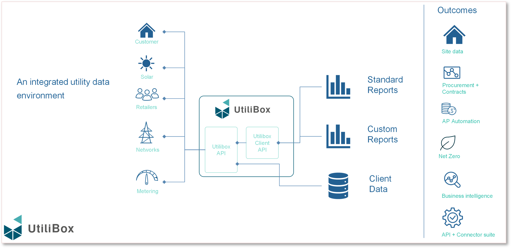

# Data Integration

Utilibox offers customers a user-friendly way to navigate the often-complex energy markets. Breaking down complicated energy data sets, making things like invoices, meter data, network tariffs, and supply point details easier to understand and manage.

Energy users can now handle their energy data more effectively and without hassle.

<figure><figcaption></figcaption></figure>

<table data-view="cards" data-full-width="false"><thead><tr><th></th><th data-hidden data-card-cover data-type="image">Cover image</th><th data-hidden data-card-target data-type="content-ref"></th></tr></thead><tbody><tr><td></td><td><a href="../../.gitbook/assets/InvoiceMeter Data Upload.png">InvoiceMeter Data Upload.png</a></td><td><a href="invoices-or-meter-data-upload.md">invoices-or-meter-data-upload.md</a></td></tr><tr><td></td><td><a href="../../.gitbook/assets/Reference Data.png">Reference Data.png</a></td><td><a href="reference-data.md">reference-data.md</a></td></tr></tbody></table>
