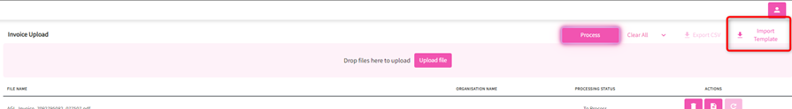

---
layout:
  width: default
  title:
    visible: true
  description:
    visible: true
  tableOfContents:
    visible: true
  outline:
    visible: true
  pagination:
    visible: false
  metadata:
    visible: false
---

# Invoices | Meter Data Upload

This feature allows you to upload invoices/meter data manually or import a template to parse and create the invoice record to its respective site.&#x20;

> _Note: Meter Data upload is only available for EAX admin users_

#### Ways to parse invoices/meter data

_**Dragging and dropping the files on the pink area.**_

<figure><figcaption></figcaption></figure>

_**Clicking on the Upload file button**_

1. File Explorer will open > navigate to where invoices/meter data to upload are stored/saved&#x20;
2. Select the file/s to be uploaded --- can be multiple, and click Open
3. This will upload the files as shown below and ready to be processed, Click on process to proceed with parsing the invoices/meter data.&#x20;
4. Upon processing, the status of each invoice/meter data will be shown on the “Processing Status” column.&#x20;
5. And will show the final status once done.
6. User can remove/view/reparse a file > a delete, view and reparse button are available at the end of each line.&#x20;

<figure><figcaption></figcaption></figure>

_**Importing a template (only applicable for invoices)**_

In instances where an excel file is provided with invoice details, this option can be used to process and link the individual invoices to its corresponding organisation.

1. Click on the Import Template button at the top right corner of the screen.&#x20;

<figure><figcaption></figcaption></figure>

2. This will download an excel template to where the details are entered following the format necessary to successfully parse the invoice details.
3. Once file is ready, the file can now be uploaded by either dragging the file or clicking on the Upload file button found in the pink area

> _Note: you can drag/upload multiple files at once including an excel file using the import template._

\*\*A csv file can be exported to show the result of the parsed invoices/meter data by clicking on the Export CSV button. An exported file includes information parsed from the invoice/meter data.
