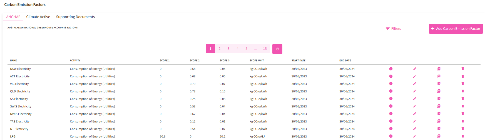
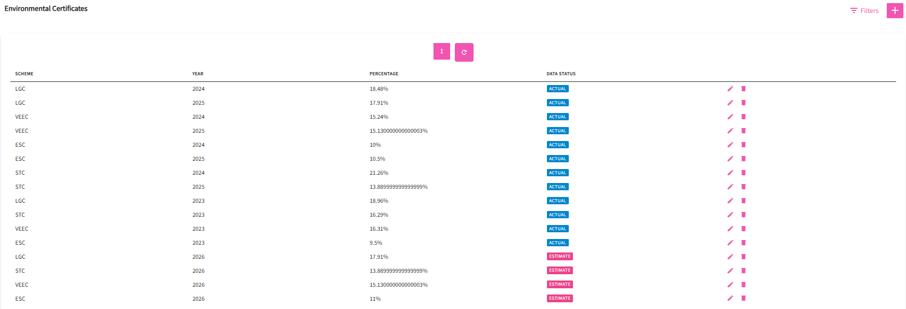
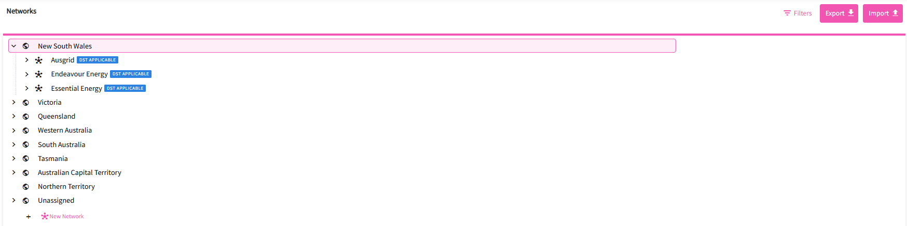
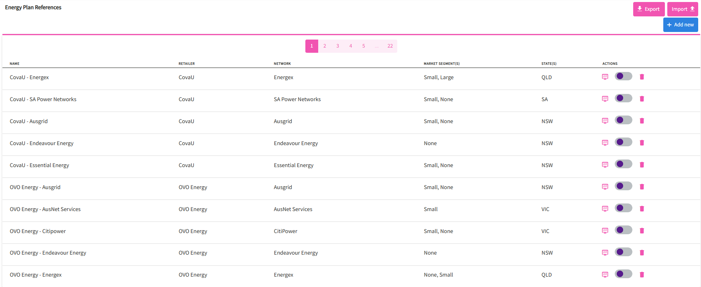

---
layout:
  width: default
  title:
    visible: true
  description:
    visible: true
  tableOfContents:
    visible: true
  outline:
    visible: true
  pagination:
    visible: false
  metadata:
    visible: false
---

# Reference Data

This feature is where Utilibox stores different data sources that is referenced across other Utilibox features like network tariff review, environmental reports and retailer information.

_Note: Most of these data are only available to view/edit for EAX admin users._

#### Emission Factors

A carbon emission factor (EF) is a coefficient that estimates how much greenhouse gas (GHG) is released into the atmosphere by a specific activity. EFs are used to calculate carbon footprints and evaluate the environmental impact of products and processes.

This feature allows Energy Action to list and manage emission factor sources used in standard and custom reports.

_Australian National Greenhouse Accounts Factors_&#x20;

<figure><figcaption></figcaption></figure>

_Climate Active_&#x20;

<figure><figcaption></figcaption></figure>

#### Environmental Certificate

An environmental certificate is a tradable unit of proof for achieving a specific environmental outcome, such as generating renewable energy or reducing energy consumption. These certificates are issued under government schemes and incentivize activities that reduce greenhouse gas emissions and promote clean energy.

This feature allows Energy Action to list and manage issued certificates yearly and used in standard and custom reports.

<figure><figcaption></figcaption></figure>

#### Consumer Price Index

The Consumer Price Index (CPI) tracks the average price changes of energy products and services bought by households. The Australian Bureau of Statistics (ABS) collects prices from energy providers and other sources to measure these shifts, reflecting increases or decreases in household energy costs over time and helping to gauge inflation in the energy sector.

<figure><figcaption></figcaption></figure>

#### Networks

A network tariff is a charge by electricity network businesses (DNSPs) for the use of their poles and wires infrastructure to deliver electricity, covering the costs of building, maintaining, and operating the network. These charges are separate from the cost of the electricity itself and are regulated by the Australian Energy Regulator (AER), requiring DNSPs to submit tariff structure statements for approval. The structure of these tariffs can be complex and varies by state and provider.

This feature allows Energy Action to list and manage available network tariffs used in standard and custom reports.

<figure><figcaption></figcaption></figure>

#### Retailers

An energy retailer is the company that buys wholesale electricity or gas and sells it directly to homes and businesses, acting as the final link in the supply chain to the end-user customer.

This feature allows Energy Action to list and manage all market participants who provide service to their clients.

<figure><figcaption></figcaption></figure>

#### Energy Plan Reference

An "energy plan reference" typically refers to the Default Market Offer (DMO), which is a regulated price cap on electricity plans set by the Australian Energy Regulator (AER) for Victorian households and small businesses. This DMO acts as a reference price, making it easier for consumers to compare different retailers' standing offer plans by providing an annual maximum total bill amount, ensuring that retail plans do not exceed this benchmark.

This feature allows Energy Action to list and manage available energy plan references used in standard and custom reports.

<figure><figcaption></figcaption></figure>
