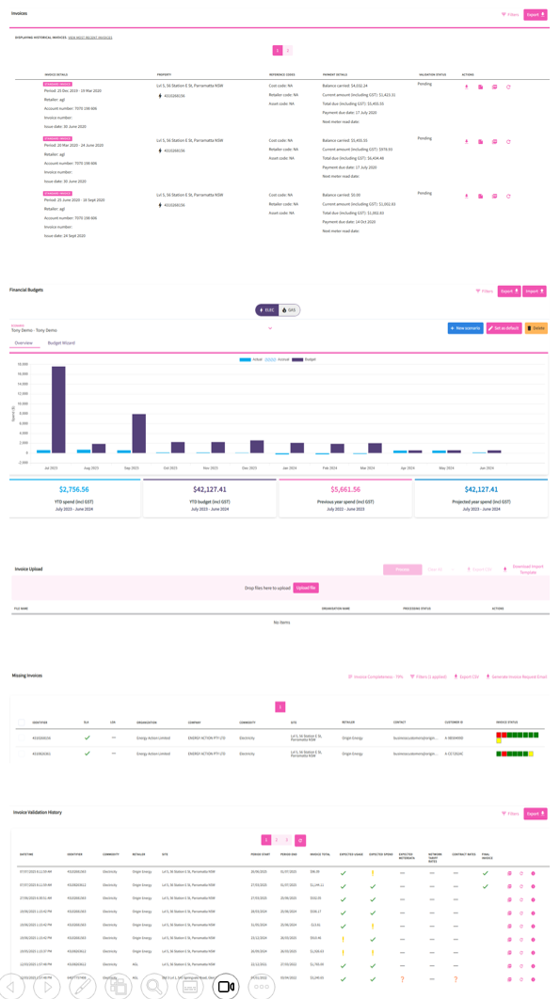

# Finance

Utilibox' finance module is all about making financial tasks simpler:

* Automating accounts payable tasks
* Provide spending and accrual files
* Lets you plan budgets under different scenarios
* Monitor invoice completion and validation

Also has a feature for uploading bills. Allowing users to improve the quality of their invoice data without depending on others. Its automated invoice processing offers a single digital platform for all finance functions.

<figure><figcaption></figcaption></figure>

