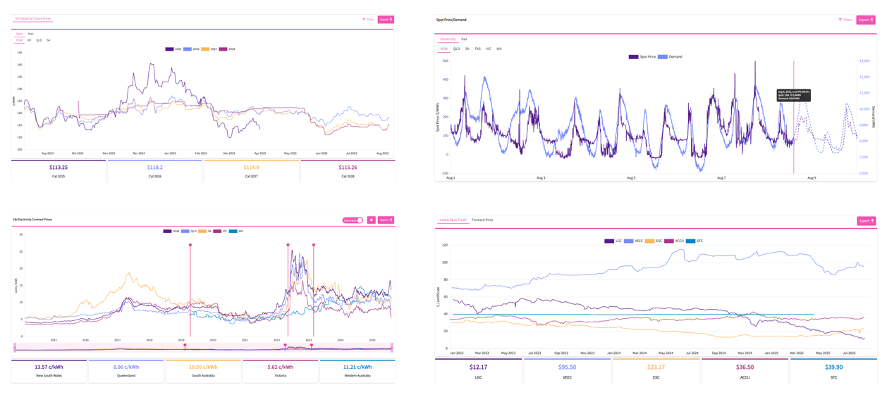

# Procurement

Utilibox offers tools for understanding energy market data, handling procurement, and managing contracts. Providing energy market data such as electricity futures, spot prices for electricity and gas, a business contract price index, and environmental certificate prices.

On the contract management side, Utilibox serves as a storage for contract documents, tracking contract prices, and sending alerts about contract end dates. Making it easier for businesses to keep on top of their energy markets and contracts.

<figure><figcaption></figcaption></figure>
