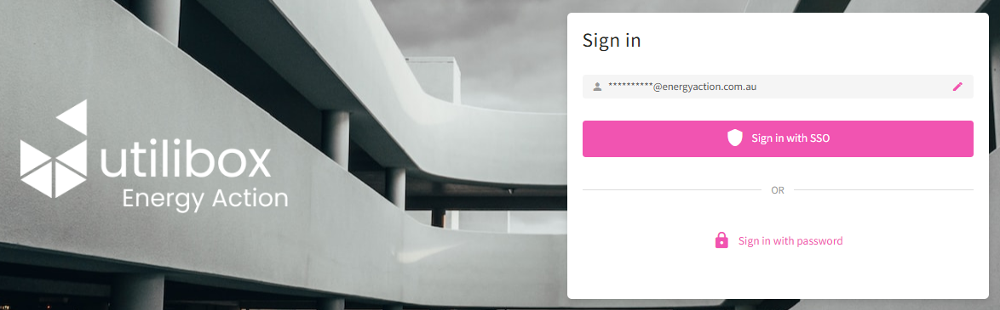

# Security

_**Two out Three Ain't Bad**_

When it comes to authentication, one out of three factors (password‑only) is bad. Multifactor authentication (MFA), on the other hand, isn’t. Utilibox employs strong authentication controls to ensure that the user attempting to log in is who they claim to be—so your data doesn’t fall into the wrong hands.

**Energy Action supports Single Sign‑On (SSO)** and offers flexible authentication configurations to suit different enterprise security requirements:

* **Username + Password with MFA**
* **SSO + Password**
* **SSO‑only**

<figure><figcaption></figcaption></figure>

Utilibox supports **any enterprise SAML token provider**, including **Microsoft Entra ID**, allowing organisations to centralise identity management while enforcing strong access controls.

_**OLA not BOLA**_

Utilibox has been written ground-up with customer cybersecurity at the forefront of the architecture. We have employed stringent Object Level Authorization design which ensures your security amongst our other secure clients.

_**Australian Privacy Regulations**_

Utilibox adheres to the regulations set forth in the Australian Privacy Act 1988. We implement stringent data protection measures, which include encrypted data storage for sensitive data, secure data transfer practices, and regular audits to ensure ongoing compliance. Our data is stored only within Australian Azure data centers.

_**Energy Action Employees are Cyber-Guardians**_

All Energy Action employees understand that they're integral to our cybersecurity fortress. Energy Action employees undergo regular cybersecurity training and participate in drills to make sure they can detect and respond quickly and effectively in the event of a security incident.
